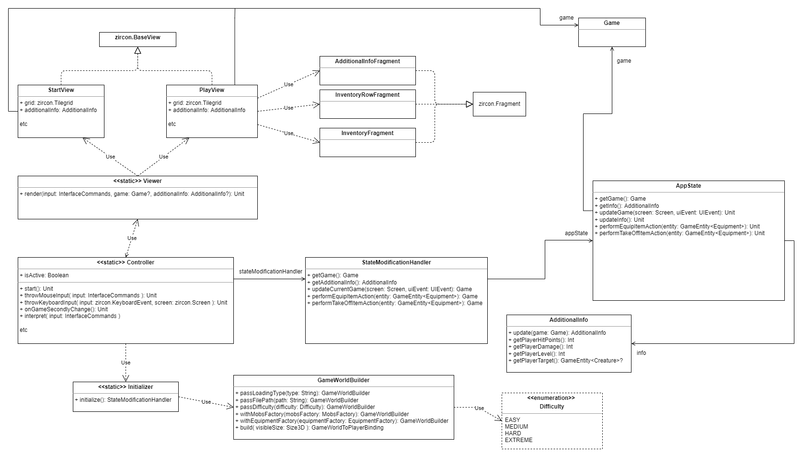
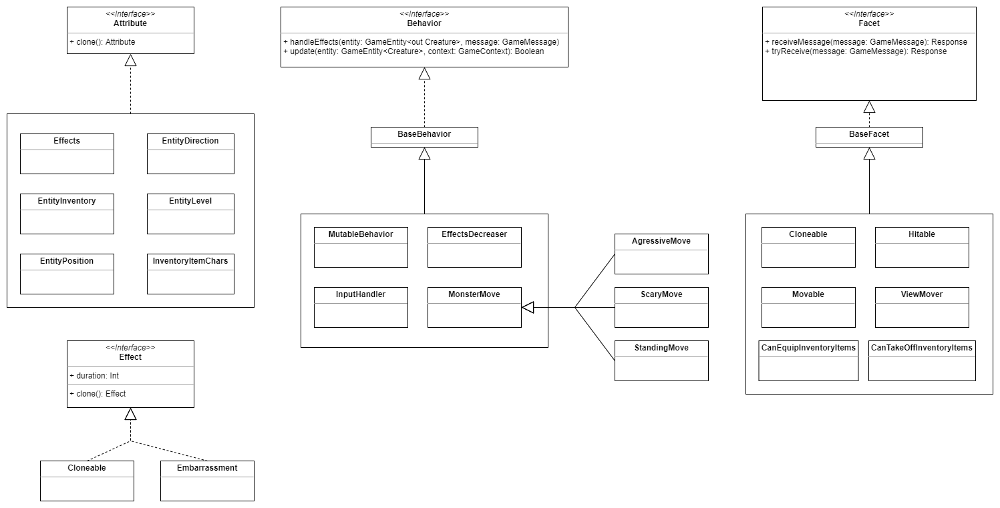
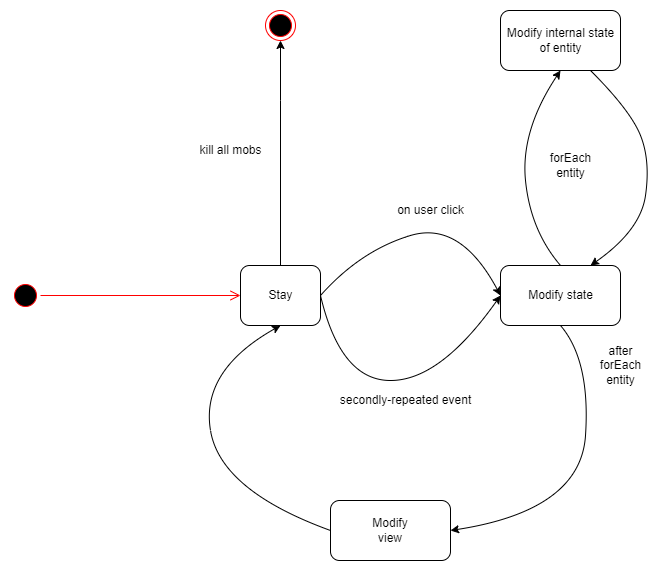
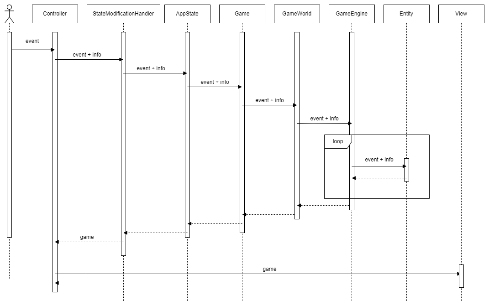

# SD-roguelike

## Разработали
1. Широков Кирилл
2. Вавилов Марк
3. Энгель Игорь

## Общие сведения
Эта Roguelike-игра предназначена для отдыха и представляет из себя "симулятор убивалки". Это значит, что цель - убить всех монстров.
Есть несколько уровней сложности и генератор случайных карт для наиболее разнообразного геймплея и большего интереса для игроков. Все объекты карты разрушаемы.
В игре имеется инвентарь и система уровней, которые внесут в игру ещё больше разнообразия.

## Ключевые требования
### Функциональные требования
1. Консольная графика
2. Персонаж должен перемещаться по карте с помощью клавиатуры (ввод игрока)
3. Лишь один игрок (и только игрок) может контролировать одного персонажа в рамках модели
4. Цель игры - убить всех монстров на карте
5. Игровое пространство состоит из клеток, на которых могут находиться: игрок, монстр или предмет инвентаря
6. Предметы инвентаря имеют несколько типов: оружие (меч, посох и тд), броня (голова, корпус, ноги и руки)
7. У каждой живой сущности имеются здоровье, урон за удар и позиция на поле.
8. У предметов инвентаря имеются повышающие характеристики. Их можно подобрать с поля и экипировать для применения бонусов к характеристикам персонажа
9. Если здоровье игрока становится меньше нуля - смерть
10. Игра посекундного реального времени (монстры действуют независимо от действий пользователя)

### Качественные требования
1. Возможность расширения для поддержки кастомизации
2. Система должна быть самодостаточной на любой платформе, не зависеть от внешних данных
3. Поддержка Windows, Linux, MacOS

### Бизнес требования
1. 2 месяца на разработку

## Роли и случаи использования
### Роли
1. Игрок
2. Roguelike-фанат
3. Разработчик

### Типичный игрок
Уставший после работы или тяжелого дня человек, геймер

### Случаи использования
1. Пользователь хочет отдохнуть. Необходимо предоставить ему понятный интерфейс и не перегруженную картинку в консоли
2. Roguelike-фанат хочет кастомизировать графику или добавить новые элементы. Для этого необходимо структурировать систему понятным любому человеку образом и в наиболее общем виде описать взаимодействия пользователя с игрой
3. Разработчик хочет внести изменения в отдельные модули системы, перегруппировать их, или добавить новые механики. Чтобы это сделать легко, необходимо сразу же подумать о расширяемости системы

## Структура
### Описание компонентов системы

1. **Main component** - точка входа
2. **Controller** - обеспечивает обработку данных от пользователя
3. **Initializer** - обеспечивает генерацию исходных данных игры
4. **Model** - это набор компонентов, которые сообщаются друг с другом для поддержки корректности изменения состояния приложения
    - **Engine** - компонент, хранящий в себе сущности приложения, а значит способный изменять состояние
    - **State** - хранит состояние, не может изменять его так как не обладает знаниями для этого
    - **State Modification handler** - обеспечивает общение системы с состоянием
5. **View** - обеспечивает отображение состояния на экране, используя библиотеку Zircon

### Структура классов системы

1. Class Controller содержит в себе состояние программы на уровне администрирования (начата ли игра, достигнута ли победа, открыты ли диалоговые окна и тд)
2. Class AppState является хранилищем состояния, при этом его методы являются строгим подмножеством методов из StateModificationsHandler. GameMap и AdditionalInfo имеют методы, связанные лишь только с их уровнем абстракции
3. StateModificationsHandler в данной ситуации не играет значительной роли, но полезен будет для (возможно) логирования действий, удобен для работы с несколькими состояниями (если такое потребуется), в том числе, например, для реализации Сохранений
4. Viewer использует набор экранов, созданных с помощью библиотеки Zircon, применяя тот или иной в зависимости от команды пришедшей из Controller.
5. В самом начале игры запускается Initializer, который генерирует начальное состояние приложения с помощью строителя GameWorldBuilder и передаёт его в Controller для дальнейшей работы.
6. Один из циклов работы приложения (ход пользователя) происходит путем передачи внутрь состояния необходимых данных, собираемых на всех уровнях иерархии Controller -> StateModificationHandler -> AppState -> Game.

1. Класс Game хранит в себе поле GameWorld, а также игрока -- класс GameEntity<T>, параметризованный объектом Player
2. GameWorld хранит в себе движок. При желании обновиться, GameWorld не делает это самостоятельно, а вызывается движок, который делает всё за него. В любой игре состояние может изменяться лишь под действием сущностей, которые в ней находятся, поэтому движок для каждой сущности запускает процесс обновления состояния (вызовы behaviors, о которых далее), что в дальнейшем приводит к изменению всего состояния GameWorld, на чём итерация завершается, а обновлённая информация показывается на экране.
3. GameWorld также хранит карту, состоящую из GameBlock, определённого размера, сгенерированную в Initializer  в самом начале игры (и изменяющуюся в процессе)
4. GameEntity<BaseType> -- класс любой сущности в игре, а наследование происходит путем наследования аргумента конструктора Type в параметре. (схема наследования от BaseType приведена)

Здесь представлено разделение 

1. Attributes отвечают за характеристики существ в игре (здоровье/урон/уровень/внешность/позицию/инвентарь и тд). Они определяются для определённых типов сущностей через typealias. Например, здоровье, урон и уровень заданы для GameEntity<Creature> (живой сущности), а добавочные здоровье и урон для GameEntity<Equipment> (экипировки).
2. Behaviors отвечают за внутреннее поведение существ, где определяется необходимость или желание их совершить то или иное действие (в случае пользовательского ввода происходит интерпретация в контекст игры). Там создаются сообщения (GameMessage), которые затем передаются сущности и которые та пытается обработать.
3. Facets отвечают за внешнее поведение. Получив сообщение, конкретный Facet интерпретирует его и соответствующим образом воздействует на состояние игры (GameWorld), которое изменяется, тем самым изменяя своё отображение на экране.
4. Effects - это дополнительные атрибуты с ограниченным периодом действия. Они могут влиять на поведение персонажа (Behavior), или же на другие аттрибуты (не представлено в данном приложении)

### Основные циклы системы

Изначально вы заходим в приложение и попадаем в состояние **Stay**. Каждую секунду мы обновляем состояние (**Modify state**), проходя по всем доступным сущностям (**Modify internal state**), а затем обновляем картинку на экране(**Modify view**). Помимо этого, аналогичный цикл происходит при нажатии клавиши действия пользователем.

### Диаграмма последовательностей для одного хода пользователя

Здесь показана полная цепочка действий (по всем задействованным классам). В Entity как раз и происходит работа по обновлению состояния приложения. В конце полученная, обновлённая версия состояния отправляется на отрисовку во View.
