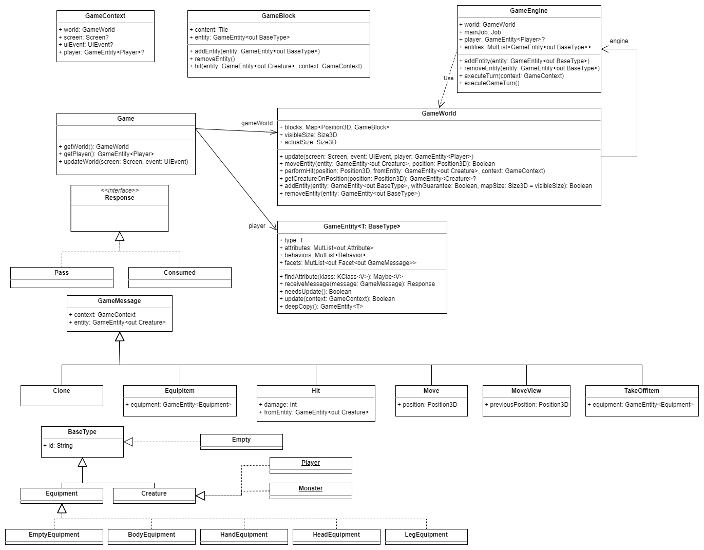

# Software Development. Roguelike game

## How to play

```
cd app
./gradlew run
```

## Controls
- `WASD` -- movement
- `Space` -- break a wall or hit a monster
- `i` -- open inventory

## Developers
1. Kirill Shirokov
2. Mark Vavilov
3. Igor Engel

## About this game
This Roguelike game is designed for relaxation and is a simulator of a hunter. This means that the goal is to defeat all the monsters. There are several difficulty levels and a random map generator for a more diverse gameplay and greater interest for players. All map objects are destroyable. The game includes an inventory and leveling system, adding even more variety to the gameplay.

## Main requirements
### Functional requirements
1. Console graphics
2. Character should move around the game field with user input
3. One player (and only the player) can control only one character in the model
4. Aim - hunt all the monsters on a virtual map
5. Game field consists of squares on which either of 4 things can appear: a player, a monster, an obstacle or an inventory item
6. Types of inventory items: weapons (sword, staff etc), armor (head, body, hand, leg)
7. Every entity alive has: health, damage per hit and position on the map.
8. Inventory items do upgrade your stats. They can be found on the field and then equipped to upgrade character stats
9. If the health of the character is less or equal 0 - death
10. Monsters behavior does not depend on behavior of the character

### Quality requirements
1. Ability to extend the game to handle customization
2. System should be able to run on MacOS, Windows and Linux without additional external resourses

### Business requirements
1. 2 months for development

## Roles and usecases
### Roles
1. Player
2. Roguelike-enjoyer
3. Developer

### Average player
Gamer after work

### Typical usecases
1. Users want to relax. It is necessary to provide them with a clear interface and an uncluttered visual experience in the console
2. A Roguelike enthusiast wants to customize graphics or add new elements. To achieve this, it is necessary to structure the system in a way understandable to anyone and describe the user's interactions with the game in the most general form
3. The developer wants to make changes to individual modules of the system, reorganize them, or add new mechanics. To make this easy, it is necessary to immediately consider the extensibility of the system


## Structure
### System components description


1. **Main component** - entry point
2. **Controller** - processes the data that comes from the user 
3. **Initializer** - generates the initial game data
4. **Model** - a set of components which are connected to each other to make proper state transitions during the game
    - **Engine** - component that can modify the data in the state given the previous state and user action
    - **State** - storage of the game data
    - **State Modification handler** - component that enables connection between the game and it's state
5. **View** - renders the image from the current game state using Zircon library

### System class structure


1. Class `Controller` contains the program's administrative-level state (whether the game has started, whether victory has been achieved, whether dialog windows are open, etc.)
2. Class `AppState` serves as the storage for the state, and its methods form a strict subset of methods from `StateModificationsHandler`. `GameMap` and `AdditionalInfo` have methods related only to their level of abstraction
3. In current development state, `StateModificationsHandler` does not play a significant role but can be useful for (possibly) logging actions, convenient for working with multiple states (if needed), including, for example, implementing save functionality
4. `Viewer` uses a set of screens created using the Zircon library, choosing one of them depending on the command received from `Controller`
5. In the beginning of the game, the `Initializer` is launched, which generates the initial application state using the `GameWorldBuilder` and passes it to `Controller` for further processing
6. One of the application's loops (user turn) occurs by passing necessary data inside the state, collected at all levels of the hierarchy: `Controller` -> `StateModificationHandler` -> `AppState` -> `Game`



1. The class `Game` stores the `GameWorld` field and the player as an instance of parameterized class `GameEntity<T>`, with `Player` as the type parameter.

2. `GameWorld` contains the game engine. When it wants to update, `GameWorld` does not do it independently. Instead, the engine is called, which handles everything on its behalf. In any game, the state can only change under the influence of entities within it. Therefore, the engine initiates the state update process for each entity (invokes "behaviors", about them later), leading to the modification of the entire `GameWorld` state. The iteration ends, and the updated information is displayed on the screen.

3. `GameWorld` also holds a map composed of `GameBlocks`, defined by a certain size, generated by the `Initializer` in the beginning of the game (and subject to changes during gameplay).

4. `GameEntity<BaseType>` is a class representing any entity in the game. Inheritance occurs through the inheritance of the `Type` constructor argument in the parameter (an inheritance diagram from `BaseType` is provided).


Here you can see the partition into Attributes, Behaviors, Facets and Effects (ABF)

1. Attributes: They are responsible for the characteristics of entities in the game (health/damage/level/appearance/position/inventory, etc.). They are defined for specific types of entities through typealias. For example, health, damage, and level are specified for `GameEntity<Creature>` (living entity), while additional health and damage are defined for `GameEntity<Equipment>` (equipment).

2. Behaviors: They are responsible for the internal behavior of entities, determining the need or desire to perform specific actions (in the case of user input, an interpretation of it into the game context is done). Messages (`GameMessage`) are created, then passed to entities, which attempt to process them.

3. Facets: They are responsible for external behavior. Upon receiving a message, a specific Facet interprets it and influences the game state (`GameWorld`), thereby altering its representation on the screen.

4. Effects: These are additional attributes with a limited duration. They can influence the behavior of characters (Behavior) or other attributes (not implemented yet in this application).

### Main system cycles


Initially, you enter the application and find yourself in the **Stay** state. Every second, the state is updated (**Modify state**), going through all available entities (**Modify internal state**), and then update the image on the screen (**Modify view**). In addition to this, a similar cycle occurs when the user presses an action key but only on specific entities.

### Step-by-step diagram of the single user input


Here is the complete chain of actions (across all involved classes). In the Entity class, the work on updating the application state takes place. In the end, the obtained, updated version of the state is sent to the View for rendering.

### Necessarity of complexity

Now a bit about the necessity of such a complex architecture (division into ABF, Typealiases, a separate engine).

The idea behind ABF is quite evident. In any game, a character has attributes, and they were placed into one category. Attributes are unique to each character, distinguishing this group from Behaviors and Facets. Behaviors and Facets are the same for all entities in the game of the same logical kind. The division between them is simple: Behaviors are what an entity can potentially do (move, attack, etc.), while a Facet is a specific way to perform those potentially possible actions (approach, retreat, stand still, etc.). Various effects can influence a Facet, while they don't affect Behaviors. Effects, being elements with a limited duration, are placed in a separate category. Since the set of effects is unique for each entity, saving effects is included in attributes.

About Typealias: it's just convenient. We highlight a subset of entities that can have certain parameters and refer to them with human-readable names. Since there aren't many such groups within the game, it doesn't cause confusion.

A separate engine. I decided to store the set of entities separately from the actual state. Here it's essential to clarify that since the "Map" is the only and the most extensive object, using it as a state container is quite efficient. However, as an object, the "Map" shouldn't be able to influence entities, to "make them do something." Therefore, all entity actions have been placed in a separate class, the "Engine," which is stored in the "Map" as the main state container.
