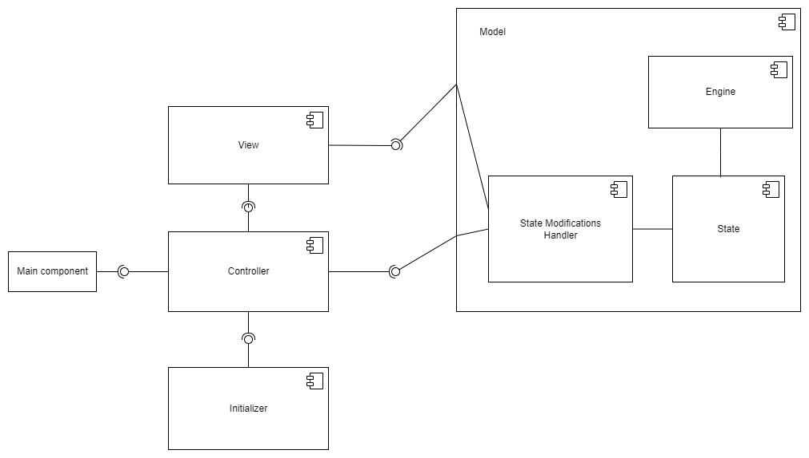

# SD-roguelike

## Разработали
1. Широков Кирилл
2. Вавилов Марк
3. Энгель Игорь

## Общие сведения
Эта Roguelike-игра предназначена для отдыха и представляет из себя "симулятор убивалки". Это значит, что цель - убить всех монстров.
Есть несколько уровней сложности и генератор случайных карт для наиболее разнообразного геймплея и большего интереса для игроков. Все объекты карты разрушаемы.
В игре имеется инвентарь и система уровней, которые внесут в игру ещё больше разнообразия.

## Ключевые требования
### Функциональные требования
1. Консольная графика
2. Персонаж должен перемещаться по карте с помощью клавиатуры (ввод игрока)
3. Лишь один игрок (и только игрок) может контролировать одного персонажа в рамках модели
4. Цель игры - убить всех монстров на карте
5. Игровое пространство состоит из клеток, на которых могут находиться: игрок, монстр или предмет инвентаря
6. Предметы инвентаря имеют несколько типов: оружие (меч, посох и тд), броня (голова, корпус, ноги и руки)
7. У каждой живой сущности имеются здоровье, урон за удар и позиция на поле.
8. У предметов инвентаря имеются повышающие характеристики. Их можно подобрать с поля и экипировать для применения бонусов к характеристикам персонажа
9. Если здоровье игрока становится меньше нуля - смерть
10. Игра посекундного реального времени (монстры действуют независимо от действий пользователя)

### Качественные требования
1. Возможность расширения для поддержки кастомизации
2. Система должна быть самодостаточной на любой платформе, не зависеть от внешних данных
3. Поддержка Windows, Linux, MacOS

### Бизнес требования
1. 2 месяца на разработку

## Роли и случаи использования
### Роли
1. Игрок
2. Roguelike-фанат
3. Разработчик

### Типичный игрок
Уставший после работы или тяжелого дня человек, геймер

### Случаи использования
1. Пользователь хочет отдохнуть. Необходимо предоставить ему понятный интерфейс и не перегруженную картинку в консоли
2. Roguelike-фанат хочет кастомизировать графику или добавить новые элементы. Для этого необходимо структурировать систему понятным любому человеку образом и в наиболее общем виде описать взаимодействия пользователя с игрой
3. Разработчик хочет внести изменения в отдельные модули системы, перегруппировать их, или добавить новые механики. Чтобы это сделать легко, необходимо сразу же подумать о расширяемости системы

## Структура
### Описание компонентов системы

1. **Main component** - точка входа
2. **Controller** - обеспечивает обработку данных от пользователя
3. **Initializer** - обеспечивает генерацию исходных данных игры
4. **Model** - это набор компонентов, которые сообщаются друг с другом для поддержки корректности изменения состояния приложения
  1. **Engine** - компонент, хранящий в себе сущности приложения, а значит способный изменять состояние
  2. **State** - хранит состояние, не может изменять его так как не обладает знаниями для этого
  3. **State Modification handler** - обеспечивает общение системы с состоянием
5. **View** - обеспечивает отображение состояния на экране, используя библиотеку Zircon

### Структура классов системы

### Основные циклы системы
